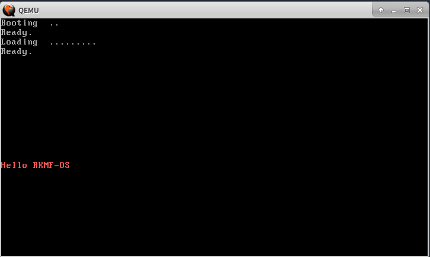
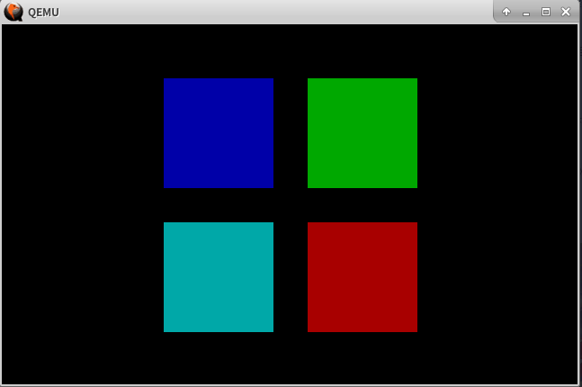
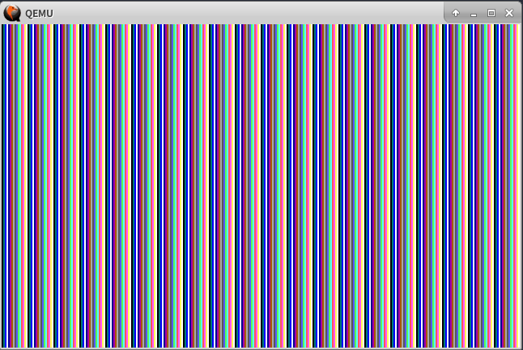
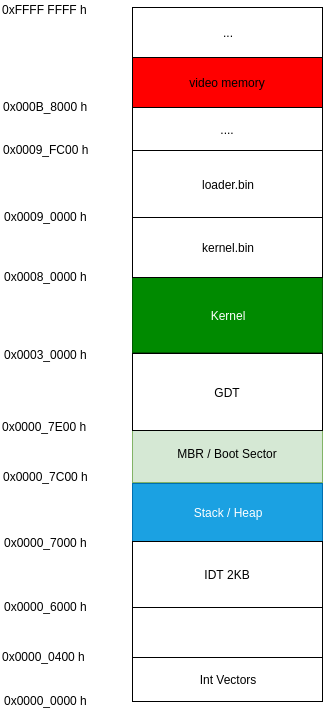

### RKMF-OS 


**A simple and beautiful operating system**


<div align="center"></div> 

------


### Run
##### On linux
1. Need to install tools below (`apt-install ${tool}` if ubuntu)
```
bochs(or qemu), bximage, ld, nasm, gcc
```

2. Build

```
make run-bochs(or make run-qemu)
```

###### on branch `hello`



###### on branch `4windows`



###### on branch `linearleaf`



### Reference

##### data

> [int_10](https://stanislavs.org/helppc/int_10.html)  
> [知乎 计算机自制操作系统](https://zhuanlan.zhihu.com/c_1193254878150045696)  
> [b站 从零开始编写操作系统](https://space.bilibili.com/5090346)  
> [b站 (兰州大学开源社区)从零开始编写操作系统](https://www.bilibili.com/video/BV14J411R7iz)  
> [oranges一个操作系统的实现](https://www.amazon.cn/dp/B00FF1Y9AQ)  
> [使用调色板绘制系统界面](https://www.jianshu.com/p/c4856ec3313f)


##### mem layout  

 
