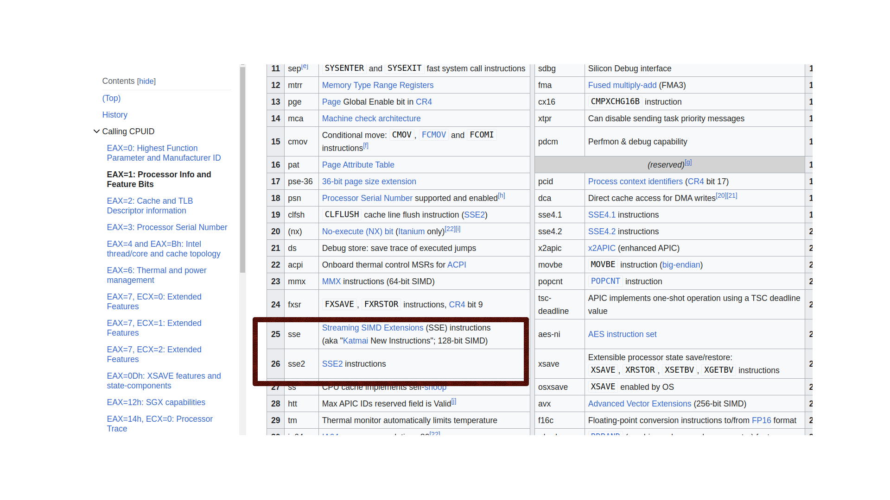

```
   0x0000000003257700 <+0>:	sub    $0x30,%rsp
   0x0000000003257704 <+4>:	mov    %rbp,0x28(%rsp)
   0x0000000003257709 <+9>:	lea    0x28(%rsp),%rbp
   0x000000000325770e <+14>:	call   0x3257040 <github.com/chainhelen/RKMF-OS/go_kernel.clear_screen>
   0x0000000003257713 <+19>:	lea    0x13e90(%rip),%rax        # 0x326b5aa
   0x000000000325771a <+26>:	mov    %rax,(%rsp)
=> 0x000000000325771e <+30>:	movq   $0x3,0x8(%rsp)
   0x0000000003257727 <+39>:	xorps  %xmm0,%xmm0
   0x000000000325772a <+42>:	movups %xmm0,0x10(%rsp)
   0x000000000325772f <+47>:	movq   $0x0,0x20(%rsp)
```

可能是使用了interface作为不定参数，导致编译器使用了 sse 加速，%xmm0寄存器，由于前置没有开启sse，指令到这基本就凉凉了。

https://github.com/golang/go/wiki/minimumrequirements#amd64 
从官方文档可以看见，默认最小集是包括 sse2，所以无关关闭，只能打开了.

我们只打开 SIMD中SSE的相关指令
// https://wiki.osdev.org/SSE 代码相关来源
// clear the CR0.EM bit (bit 2) [ CR0 &= ~(1 << 2) ]
// set the CR0.MP bit (bit 1) [ CR0 |= (1 << 1) ]
// set the CR4.OSFXSR bit (bit 9) [ CR4 |= (1 << 9) ]
// set the CR4.OSXMMEXCPT bit (bit 10) [ CR4 |= (1 << 10) ]

同时我们可以check一下

```
to check for SSE CPUID.01h:EDX.SSE[bit 25|26] needs to be set
```
https://en.wikipedia.org/wiki/CPUID#EAX=1:_Processor_Info_and_Feature_Bits




### qemu 内存空间
按道理来说可以从mulitiboot的格式信息中拿到总的可以访问数据，这里偷懒了。直接指定了物理内存地址，注意我们保持256M的内存地址，qmue启动的时候需要指定，否则会出现默认126M的内存地址，超过0x8000000写入失败不会有任何提示，读取永远是0值。  
